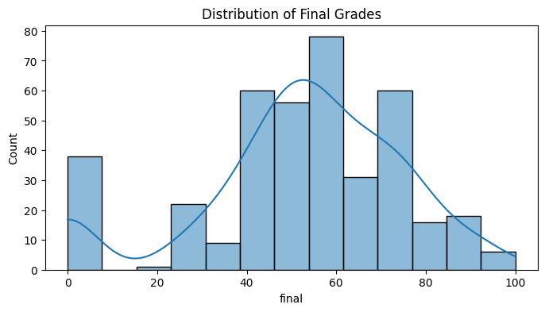
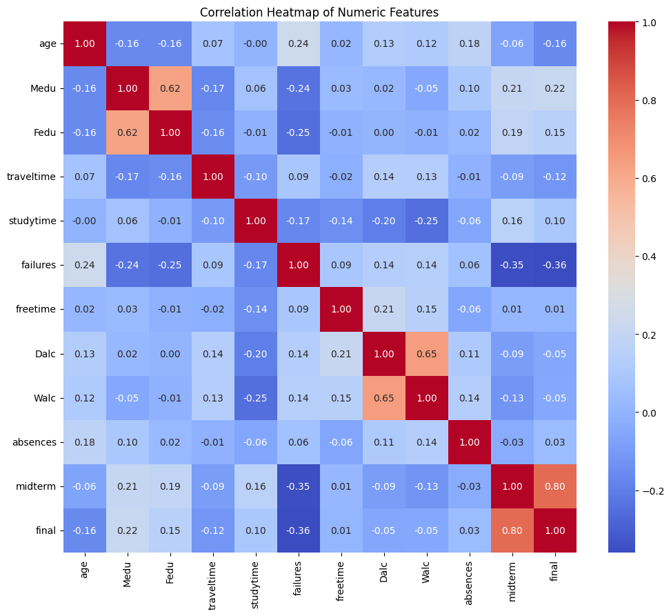
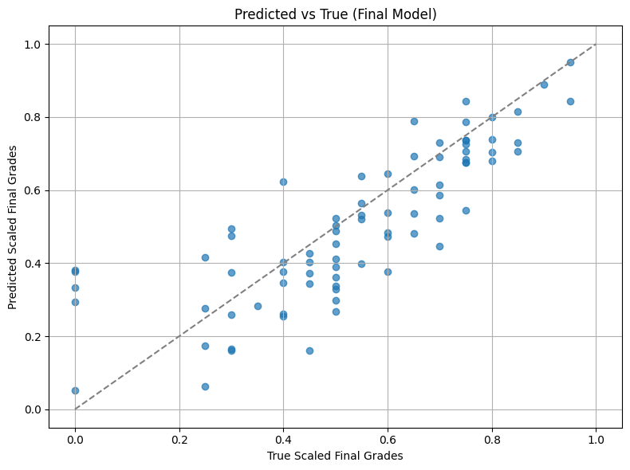

# STATS202HW
*Duke Kunshan University STATS 202 HW2*

## 🧠 Predicting Student Math Performance with Regression Models

This project explores how student demographic, behavioral, and academic features can be used to predict final math grades using machine learning techniques. The goal is to understand key drivers of academic success and build a predictive model to support early intervention.

## 📌 Problem Statement

**How can we use students’ demographic, educational, and behavioral data to build predictive models for their final mathematics performance?**

### Objectives:
- Quantify relationships between final grade and potential predictors such as parental education, study time, and midterm scores.
- Identify the most influential factors contributing to academic success or underperformance.
- Build and evaluate regression models to predict final outcomes.

## 📂 Dataset

The dataset was sourced from course's instructor and includes the following:
- **Demographic features**: age, gender, parental education, family size.
- **Academic features**: study time, previous failures, midterm scores.
- **Behavioral features**: absences, free time, alcohol consumption, extracurricular participation.

## 🛠️ Methods

1. **Exploratory Data Analysis**:
   - Plotted the distribution of final grades.
   - Generated a heatmap to visualize correlations among numerical features.

2. **Data Preprocessing & Feature Engineering**:
   - Removed missing values for target (`final`) grade.
   - Encoded binary and categorical features using manual mappings and one-hot encoding.
   - Combined parental education into a new feature `parent_edu`.
   - Normalized features and target variable using `MinMaxScaler`.

3. **Model Training**:
   - Compared **Linear Regression** and **Ridge Regression**.
   - Evaluated models based on Mean Squared Error (MSE) and R² Score.

4. **Model Selection**:
   - Selected **Ridge Regression** for its superior R².

5. **Visualization**:
   - Created a scatter plot comparing true vs. predicted scaled final grades.

## 📊 Results

- **Strongest predictor**: Midterm score (correlation with final = 0.80).
- Ridge Regression achieved a better fit with:
  - **MSE**: 0.0191
  - **R²**: 0.6276
- The model performs best for high-performing students, with some underestimation in the middle score range.
  

  

  <em>Figure 1: Distribution of Final Grades.</em>

  

  <em>Figure 2: Correlation Heatmap of Numeric Features.</em>

  

  <em>Figure 3: Predicted vs. True Final Grades (Ridge Regression).</em>

## 💡 Future Work

- Explore **nonlinear models** (Random Forest, XGBoost, Neural Networks).
- Include more **psychosocial features** (motivation, school support).
- Apply **cross-validation** and hyperparameter tuning for model robustness.
- Investigate **temporal performance trends** (if multi-year data is available).

